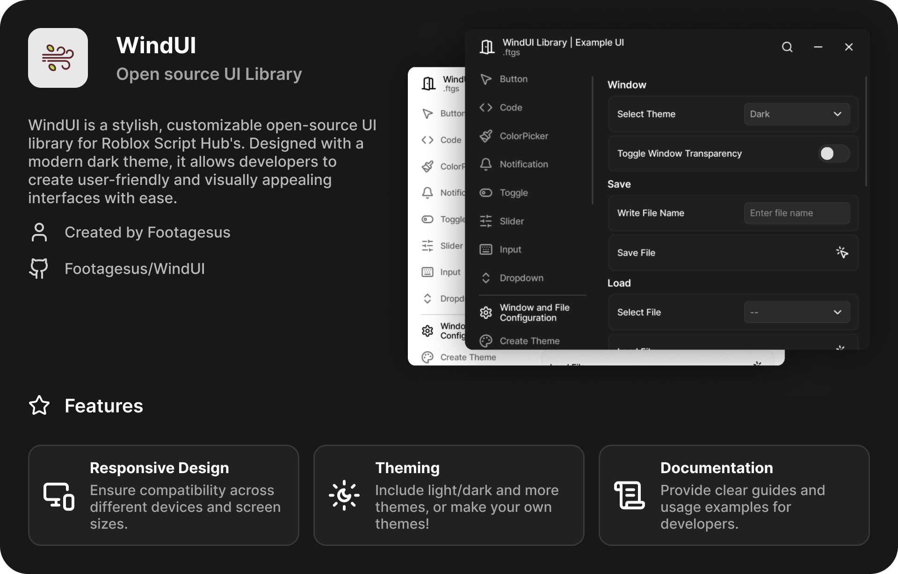

<h1 align="center">WindUI</h1align> 

### Credits:
- [Dawid-Scripts](https://github.com/dawid-scripts) (Colorpicker)
- [Lucide-Icons](https://github.com/lucide-icons/lucide) (Icons)

> [Discord Server](https://discord.gg/Q6HkNG4vwP)
> [Documentation](https://tree-hub.vercel.app/docs/WindUI)